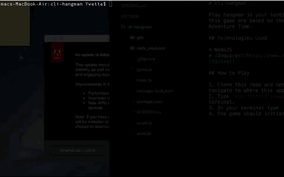

# cli-hangman

Play hangman in your terminal. The words from this game are based on the animated show, Adventure Time.

## Technologies Used

* NodeJS  
* [Inquirer](https://www.npmjs.com/package/inquirer)

## How to Play

1. Clone this repo and open your terminal to navigate to where this app is.  
2. Type `npm install inquirer` into your terminal. 
3. In your terminal type `node index.js`.  
4. The game should initiate after that.